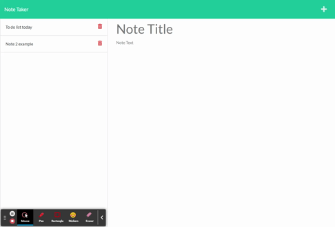

# NOTE-TAKER

This is a Note Taker. The app uses a middleware to connect front end pages and back end database. The db.json that stores and retrives notes. There's GET/POST/DELETE routes to ready/write/delete a specific note.

## Table of Contents
1. [Setup](#setup)
2. [Design](#design)
3. [Links](#links)
4. [Demo](#demo)
5. [License](#license)

## Setup

npm express and uuid is required to be installed first. Type "npm start" to run it on local machine on localhost:3001. Or open the heroku deployed site [link](https://quiet-eyrie-97635.herokuapp.com/).

## Design

* All files are stored in a structured folder
* Loads server.js first when the app starts running. It listens to "/", "/notes", or wildcard "*"
* When user loads the index.html and clicks on the "Get started", it loads the notes.html successfully
* In the notes.html, it listens to user's input to create a note, store a note to the db.json file, or delete a note from the db.json file
* In the notes.html, when user clicks on a new note, it creates an empty note. When a user clicks on a existing note, it displays the note content

## Links

Please check out [Heroku Page](https://quiet-eyrie-97635.herokuapp.com/) for the app.
Or check out [Github Page](https://github.com/shaotangyen/team-profile-generator) for the code.

## Demo

The following animation demonstrates the Note Taker functionality:

## License

Copyright 2021 Shao Yen

Permission is hereby granted, free of charge, to any person obtaining a copy of this software and associated documentation files (the "Software"), to deal in the Software without restriction, including without limitation the rights to use, copy, modify, merge, publish, distribute, sublicense, and/or sell copies of the Software, and to permit persons to whom the Software is furnished to do so, subject to the following conditions:

The above copyright notice and this permission notice shall be included in all copies or substantial portions of the Software.

THE SOFTWARE IS PROVIDED "AS IS", WITHOUT WARRANTY OF ANY KIND, EXPRESS OR IMPLIED, INCLUDING BUT NOT LIMITED TO THE WARRANTIES OF MERCHANTABILITY, FITNESS FOR A PARTICULAR PURPOSE AND NONINFRINGEMENT. IN NO EVENT SHALL THE AUTHORS OR COPYRIGHT HOLDERS BE LIABLE FOR ANY CLAIM, DAMAGES OR OTHER LIABILITY, WHETHER IN AN ACTION OF CONTRACT, TORT OR OTHERWISE, ARISING FROM, OUT OF OR IN CONNECTION WITH THE SOFTWARE OR THE USE OR OTHER DEALINGS IN THE SOFTWARE.